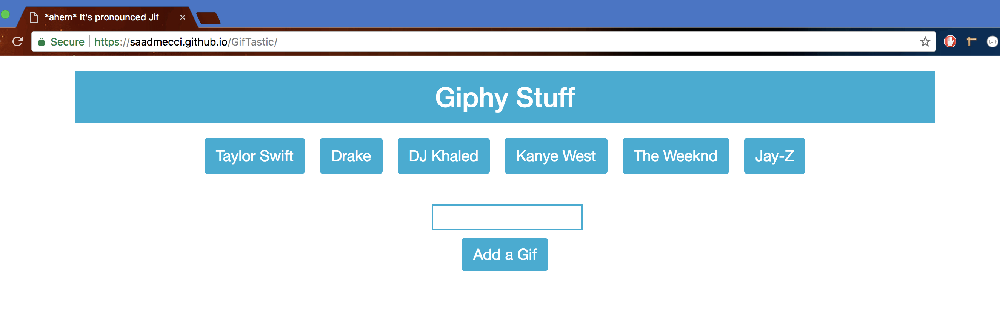

# GifTastic

A [Gif generating web application](https://saadmecci.github.io/GifTastic/) I created so users can enjoy their favorite Gifs.

It uses bootstrap and css for the styling, jQuery and javascript for the logic.

It uses the **Giphy API** to search for and display gifs on html page.

Initial Gif that appears will be a still image. 

Gif will animate when the user clicks on the image.

The image below is what users see when they first visit the site:

I went with a theme of music artists but the user can search for any topic they want that is available on giphy.

For example, users can type in "Cats" which then makes a fully functioning "Cats" button when the **Add a Gif** button is clicked.

Once the new button is clicked, still images appear which can be clicked to animate them.

